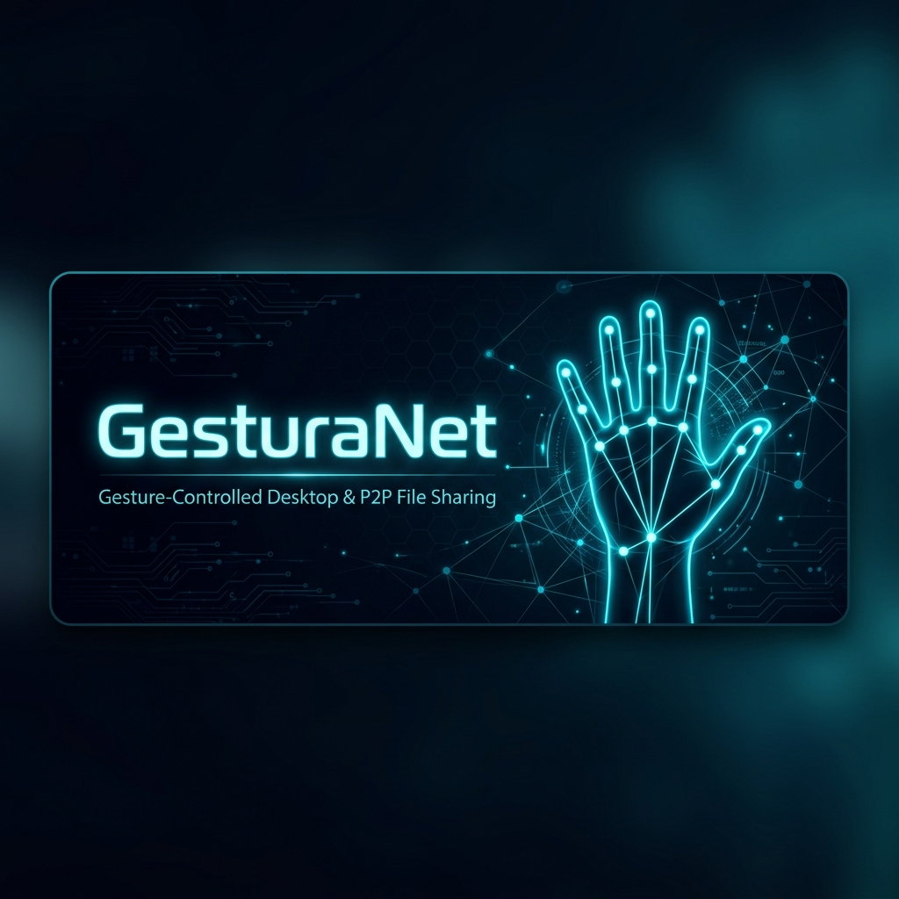

<p align="center">
  
</p>

<p align="center">
  
  
  
  
  
  
</p>

<p align="center">
  <b>Control your entire PC — cursor, volume, brightness, and file sharing — using nothing but hand gestures.</b>
</p>

---

## 📖 Table of Contents

- [What is GesturaNet?](#-what-is-gesturanet)
- [Key Features](#-key-features)
- [Demo](#-demo)
- [Architecture](#-architecture)
- [Project Structure](#-project-structure)
- [Prerequisites](#-prerequisites)
- [Installation Guide](#-installation-guide)
- [Running the Application](#-running-the-application)
- [Usage Guide](#-usage-guide)
- [Gesture Reference](#-gesture-reference)
- [Configuration](#%EF%B8%8F-configuration)
- [Tech Stack](#-tech-stack)
- [Troubleshooting](#-troubleshooting)
- [Contributing](#-contributing)
- [License](#-license)

---

## 💡 What is GesturaNet?

GesturaNet is a three-part system that transforms your webcam into a full computer controller:

1. **Python Gesture Engine** — Captures your webcam feed, detects hand landmarks using Google's MediaPipe, classifies gestures in real-time, and translates them into OS-level actions (mouse movement, clicks, keyboard shortcuts).

2. **Node.js Backend** — Acts as the central hub. It bridges the gesture engine to the frontend via WebSockets, runs a P2P file sharing server over your local network, and handles peer discovery, handshakes, and file streaming.

3. **React Frontend** — A "Surgical Interface" themed dashboard where you can monitor gesture activity, adjust engine settings, and manage file transfers — all in real-time.

> **Why "GesturaNet"?** It's a portmanteau of *Gesture* + *Net* (network). You can control your computer with gestures, and share files across your network — with gestures too.

---

## 🌟 Key Features

### 🖱️ Full Desktop Control (Set 1)
Move your cursor, click, double-click, drag & drop, and scroll — all with precise hand gestures. The cursor uses exponential smoothing for buttery-smooth movement.

### 🔊 System Controls (Set 2)
Pinch your index+thumb and slide up/down to control **volume**. Pinch middle+thumb for **brightness**. No need to reach for keyboard shortcuts.

### 📡 Gesture-Based File Sharing
Select a file anywhere on your desktop →  make a **closed fist** for 2 seconds → the file is automatically dispatched to every device running GesturaNet on your LAN. On the receiving device, hold an **open palm** for 2 seconds to accept.

### 🎛️ Live Dashboard
A premium dark-themed React interface with real-time gesture state, camera feed, activity logs, and engine parameter controls.

---

## 🎥 Demo

> _After starting all three components, open your browser to `http://localhost:5173`._

**Cursor Mode (Set 1):** Point your right hand at the camera. Pinch your index and middle fingers together to move the cursor. Pinch index+thumb to click.

**System Mode (Set 2):** Hold 2 fingers up on your left hand to switch modes. Now pinch index+thumb and drag up/down to control volume.

**File Sharing:** Select a file on your desktop, switch to Set 2, and hold a closed fist for 2 seconds. That's it — the file flies across your network.

---

## 🏗️ Architecture

```
┌──────────────────────────────────────────────────────────────────┐
│                         GesturaNet                               │
│                                                                  │
│  ┌────────────────┐   WebSocket           ┌────────────────────┐ │
│  │  Python Engine  │ ──────────────────▶ │  Node.js Backend    │  │
│  │                 │                      │                    │  │
│  │  • Camera Feed  │                      │  • Express REST    │  │
│  │  • MediaPipe    │                      │  • WebSocket Hub   │  │
│  │  • Gesture AI   │                      │  • P2P Discovery   │  │
│  │  • PyAutoGUI    │                      │  • File Transfer   │  │
│  │  • Set 1 + 2    │                      │  • Native Dispatch │  │
│  └────────────────┘                      └─────────┬──────────┘  │
│                                           WebSocket│ (5000/ws)   │
│                                                    ▼             │
│                                         ┌────────────────────┐   │
│                                         │  React Frontend     │   │
│                                         │                    │   │
│                                         │  • Dashboard UI    │   │
│                                         │  • File Vault      │   │
│                                         │  • Gesture Monitor │   │
│                                         │  • Engine Controls │   │
│                                         └────────────────────┘   │
│                                                                  │
│                    UDP Broadcast                           │
│  ┌──────────┐  ◄──── Peer Discovery ────▶  ┌──────────────┐     │
│  │  Your PC  │  ◄──── File Streams ─────▶  │  LAN Peer(s) │     │
│  └──────────┘                               └──────────────┘     │
└──────────────────────────────────────────────────────────────────┘
```

**Data Flow:**
1. Python Engine captures webcam → detects hand → classifies gesture
2. Gesture state is broadcast via WebSocket to Node.js backend (port `8765`)
3. Backend relays to React frontend via browser WebSocket (port `5000/ws`)
4. Frontend renders state, Engine executes OS actions (cursor, clicks, etc.)
5. For file sharing: Engine → `Ctrl+C` → clipboard → HTTP POST to backend → P2P stream

---

## 📂 Project Structure

```
GesturaNet/
│
├── Engine/                              # 🐍 Python Gesture Engine
│   ├── main.py                          #    Entry point — starts 3 threads
│   ├── camera.py                        #    OpenCV capture + MediaPipe loop
│   ├── gesture_detector.py              #    Set 1 gesture classification
│   ├── cursor_controller.py             #    Gesture → OS action mapping
│   ├── state.py                         #    Shared application state
│   ├── config.py                        #    Tunable thresholds & constants
│   ├── mediapipe_setup.py               #    MediaPipe HandLandmarker init
│   ├── draw_utils.py                    #    Landmark overlay renderer
│   ├── websocket_server.py              #    Async WS broadcast server
│   ├── hand_landmarker.task             #    MediaPipe model weights
│   └── gesture_modes/
│       ├── mode_selector.py             #    Left hand → mode switch
│       ├── set1_cursor.py               #    Set 1 processor
│       └── set2_system.py               #    Set 2 processor + file dispatch
│
├── backend/                             # 🟢 Node.js Backend
│   ├── index.js                         #    Main server + all routes
│   ├── discovery.js                     #    UDP peer discovery
│   ├── handshake.js                     #    Transfer negotiation (UI-driven)
│   ├── transfer.js                      #    Raw byte stream sender
│   ├── progress.js                      #    Transfer progress tracker
│   ├── resume.js                        #    Interrupted transfer resume
│   ├── integrity.js                     #    SHA-256 verification
│   ├── network_utils.js                 #    Local IP utility
│   ├── colors.js                        #    Terminal color output
│   ├── received_files/                  #    Downloaded files directory
│   └── package.json
│
├── frontend/gesturaNet-frontend/        # ⚛️ React Frontend (Vite)
│   └── src/
│       ├── App.jsx                      #    Root component + transfer modal
│       ├── pages/
│       │   ├── SurgicalDashboard.jsx    #    Main dashboard with tabs
│       │   └── FileDispatcher.jsx       #    File Vault + dispatch UI
│       └── hooks/
│           ├── useGestureSocket.js      #    WebSocket state hook
│           └── useFilePeer.js           #    Peer discovery + file send hook
│
├── assets/                              # 📦 Static assets
│   └── banner.png
├── requirements.txt                     # Python dependencies (pinned)
└── README.md                            # You are here
```

---

## 📋 Prerequisites

Before installing, ensure you have the following:

| Requirement | Version | Check Command |
|-------------|---------|---------------|
| **Python** | 3.13+ | `python --version` |
| **Node.js** | 22+ | `node --version` |
| **npm** | 11+ | `npm --version` |
| **Webcam** | Any | Built-in or USB |
| **OS** | Windows 10/11 | Required for system controls |

> ⚠️ **Important:** GesturaNet currently requires **Windows** because it relies on `pycaw` (audio), `screen-brightness-control` (display), and `PyAutoGUI` (cursor) which use Windows-specific APIs.

---

## 📥 Installation Guide

### Step 1: Clone the Repository

```bash
git clone https://github.com/Taranikrish/GesturaNet.git
cd GesturaNet
```

### Step 2: Set Up Python Environment

It's recommended to use a virtual environment:

```bash
# Create virtual environment (optional but recommended)
python -m venv venv
venv\Scripts\activate

# Install dependencies
pip install -r requirements.txt
```

<details>
<summary><b>📦 Python Dependencies (click to expand)</b></summary>

| Package | Version | Purpose |
|---------|---------|---------|
| `opencv-python` | 4.13.0.92 | Camera capture & image processing |
| `mediapipe` | 0.10.32 | Hand landmark detection (21 keypoints) |
| `pyautogui` | 0.9.54 | OS-level cursor & keyboard automation |
| `numpy` | 2.4.3 | Array operations for landmark math |
| `websockets` | 16.0 | Async WebSocket server |
| `pycaw` | 20251023 | Windows audio endpoint volume |
| `comtypes` | 1.4.16 | COM interface bridge |
| `screen-brightness-control` | 0.27.1 | Monitor brightness via WMI |
| `WMI` | 1.5.1 | Windows Management Instrumentation |

</details>

### Step 3: Set Up Node.js Backend

```bash
cd backend
npm install
```

<details>
<summary><b>📦 Node.js Dependencies (click to expand)</b></summary>

| Package | Version | Purpose |
|---------|---------|---------|
| `express` | 4.18.2 | HTTP API framework |
| `ws` | 8.16.0 | WebSocket server |
| `busboy` | 1.6.0 | Multipart upload parser |
| `cors` | 2.8.5 | Cross-origin headers |
| `undici` | 6.13.0 | HTTP client for relay |
| `nodemon` | 3.0.2 | Dev auto-restart (dev only) |

</details>

### Step 4: Set Up React Frontend

```bash
cd frontend/gesturaNet-frontend
npm install
```

<details>
<summary><b>📦 Frontend Dependencies (click to expand)</b></summary>

| Package | Version | Purpose |
|---------|---------|---------|
| `react` | 19.2.4 | UI component library |
| `react-dom` | 19.2.4 | DOM rendering |
| `react-router-dom` | 7.13.2 | Client-side routing |
| `tailwindcss` | 4.2.2 | Utility-first CSS |
| `vite` | 8.0.0 | Build tool & HMR dev server |

</details>

---

## ▶️ Running the Application

GesturaNet has three components that run simultaneously. Open **three separate terminals**:

### Terminal 1 — Gesture Engine 🐍

```bash
cd Engine
python main.py
```

You should see:
```
[Engine] Camera started
[Audio] inited volume range -65.25..0.0
```

### Terminal 2 — Backend Server 🟢

```bash
cd backend
node index.js
```

You should see:
```
========================================
  GESTRUA NET UNIFIED NODE ACTIVE
  Device : YOUR-PC
  URL    : http://localhost:5000
========================================
[Bridge] Connected ✓
```

### Terminal 3 — Frontend Dev Server ⚛️

```bash
cd frontend/gesturaNet-frontend
npm run dev
```

You should see:
```
  VITE v8.0.0  ready in 300 ms

  ➜  Local:   http://localhost:5173/
  ➜  Network: http://192.168.x.x:5173/
```

### 🎉 Open Your Browser

Navigate to **http://localhost:5173** and you'll see the Surgical Dashboard.

> **Tip:** The order matters. Start the **Engine first**, then the **Backend** (so it can connect to the engine), then the **Frontend**.

---

## 🎮 Usage Guide

### Getting Started with Gestures

1. **Position your webcam** so it can see your hands clearly
2. **Show your right hand** to activate the engine (the dashboard will show "ACTIVE")
3. Start with **Set 1 (Cursor Mode)** — it's the default

### Switching Modes

Your **left hand** acts as a mode selector:

| Left Hand | Mode |
|-----------|------|
| ☝️ 1 finger up | **Set 1** — Cursor Control |
| ✌️ 2 fingers up | **Set 2** — System Controls + File Sharing |

> Keep your left hand visible to maintain the mode. The right hand performs the actual gestures.

### Set 1: Cursor Control

| Step | Gesture | What Happens |
|------|---------|-------------|
| **Move** | Pinch index + middle fingers together | Cursor follows your hand position |
| **Left Click** | Pinch index + thumb | Single left click at cursor position |
| **Right Click** | Pinch middle + thumb | Single right click |
| **Double Click** | Pinch ring + thumb | Double click |
| **Drag** | Pinch thumb + index + middle all together | Holds mouse down, drag with movement |
| **Drop** | Release thumb while index + middle stay close | Releases the mouse button |
| **Scroll** | Cluster all 4 fingers together, hold 3s | Then move hand up/down to scroll |

### Set 2: System Controls

| Step | Gesture | What Happens |
|------|---------|-------------|
| **Volume** | Pinch index + thumb, slide hand up/down | Volume increases (up) / decreases (down) |
| **Brightness** | Pinch middle + thumb, slide hand up/down | Brightness increases (up) / decreases (down) |

### Set 2: File Sharing

#### Sending a File

1. **Select a file** on your desktop using your cursor (Set 1) or physical mouse
2. Switch to **Set 2** (hold 2 fingers on left hand)
3. Make a **closed fist** ✊ with your right hand
4. **Hold it for 2 seconds** — you'll see in the terminal:
   ```
   [Set 2] CLOSED PALM (fist) detected — hold 2s to dispatch
   [Set 2] Fist held 2.0s — DISPATCHING!
   [Set 2] Dispatching: C:\path\to\your\file.ext
   ```
5. The file is sent to every GesturaNet peer on your LAN

#### Receiving a File

1. When someone sends you a file, a **modal** appears on your dashboard
2. You can either:
   - Hold an **open palm** 🖐️ for 2 seconds to **accept**
   - Perform a **right-click gesture** to **reject**
   - Or use the UI buttons directly
3. Accepted files are saved to `backend/received_files/`

---

## 📋 Gesture Reference

<table>
<tr>
<th>Mode</th>
<th>Gesture</th>
<th>Detection</th>
<th>Action</th>
</tr>
<tr><td rowspan="7"><b>Set 1</b><br/>Cursor</td>
<td>Move</td><td>Index + Middle tips close</td><td>Cursor movement</td></tr>
<tr><td>Left Click</td><td>Index + Thumb pinch</td><td>OS left click</td></tr>
<tr><td>Right Click</td><td>Middle + Thumb pinch</td><td>OS right click</td></tr>
<tr><td>Double Click</td><td>Ring + Thumb pinch</td><td>OS double click</td></tr>
<tr><td>Drag</td><td>Thumb + Index + Middle pinch</td><td>Mouse down + move</td></tr>
<tr><td>Drop</td><td>Release thumb from drag</td><td>Mouse up</td></tr>
<tr><td>Scroll</td><td>All fingers clustered (3s)</td><td>Scroll wheel</td></tr>
<tr><td rowspan="4"><b>Set 2</b><br/>System</td>
<td>Volume</td><td>Index + Thumb pinch + Y slide</td><td>System volume</td></tr>
<tr><td>Brightness</td><td>Middle + Thumb pinch + Y slide</td><td>Screen brightness</td></tr>
<tr><td>Dispatch File</td><td>Closed fist (hold 2s)</td><td>Send file to LAN</td></tr>
<tr><td>Accept File</td><td>Open palm (hold 2s)</td><td>Accept incoming file</td></tr>
</table>

---

## ⚙️ Configuration

Engine parameters live in `Engine/config.py` and can be adjusted:

| Parameter | Default | Description |
|-----------|---------|-------------|
| `CAMERA_INDEX` | `0` | Webcam device index (change if you have multiple cameras) |
| `FRAME_WIDTH` | `640` | Camera capture width |
| `FRAME_HEIGHT` | `480` | Camera capture height |
| `CAMERA_FPS` | `30` | Target frames per second |
| `SMOOTHING` | `0.4` | Cursor smoothing (0 = raw, 1 = no lag) |
| `SCROLL_SENSITIVITY` | `10` | Scroll speed multiplier |
| `INACTIVE_TIMEOUT` | `5` | Seconds before engine enters sleep mode |
| `DRAG_THRESHOLD` | `0.08` | Normalized distance for drag detection |

> **Live Tuning:** Smoothing and Sensitivity can also be adjusted from the **Controls** tab in the dashboard without restarting the engine.

### Network Ports

| Service | Port | Protocol | Configurable |
|---------|------|----------|-------------|
| Python WS Server | `8765` | WebSocket | `Engine/websocket_server.py` |
| Node.js Backend | `5000` | HTTP + WS | `backend/.env` → `PORT` |
| React Dev Server | `5173` | HTTP | Vite default |
| LAN Peer Discovery | `41234` | UDP Broadcast | `backend/discovery.js` |

---

## 🔧 Troubleshooting

<details>
<summary><b>Engine says "Camera not found" or black screen</b></summary>

- Try changing `CAMERA_INDEX` in `Engine/config.py` to `1` or `2`
- Make sure no other application (Zoom, Teams) is using the camera
- On laptops, the built-in camera is usually index `0`

</details>

<details>
<summary><b>Backend says "[Bridge] Disconnected. Retrying..."</b></summary>

- Make sure the Python engine (`python main.py`) is running **before** starting the backend
- Check that port `8765` is not in use: `netstat -an | findstr 8765`

</details>

<details>
<summary><b>Cursor is too jittery or too laggy</b></summary>

- Adjust **Smoothing** from the Controls tab in the dashboard
- Lower values (0.2) = smoother but slower response
- Higher values (0.8) = faster but jittery
- Default `0.4` is a good balance

</details>

<details>
<summary><b>Gestures aren't being detected</b></summary>

- Ensure good lighting — MediaPipe needs clear visibility
- Keep your hand 30-60 cm from the camera
- Avoid busy backgrounds that could confuse hand detection
- Check the dashboard's "Camera" toggle to see what MediaPipe sees

</details>

<details>
<summary><b>File sharing: "No peers found"</b></summary>

- Both devices must be on the **same LAN/WiFi network**
- Both devices must be running the GesturaNet backend (`node index.js`)
- Firewall must allow UDP port `41234` and TCP port `5000`
- Wait ~5 seconds after starting for peer discovery to complete

</details>

<details>
<summary><b>Volume/Brightness control not working</b></summary>

- These features require **Windows** with appropriate drivers
- For brightness: ensure WMI is functional (`wmic` should work in CMD)
- For volume: `pycaw` requires a working audio endpoint

</details>

---

## 🤝 Contributing

Contributions are welcome! Here's how to get started:

1. **Fork** the repository
2. **Create** a feature branch: `git checkout -b feature/amazing-feature`
3. **Commit** your changes: `git commit -m 'Add amazing feature'`
4. **Push** to the branch: `git push origin feature/amazing-feature`
5. **Open** a Pull Request

### Areas for Contribution

- 🐧 **Linux/macOS support** — Port PyAutoGUI, pycaw, and brightness control
- 🎯 **New gestures** — Add a Set 3 for custom application control
- 📱 **Mobile support** — React Native companion app
- 🧠 **ML improvements** — Custom gesture model training
- 🎨 **UI themes** — Additional dashboard themes

---

## 📜 License

This project is open source and available under the [MIT License](LICENSE).

---

<p align="center">
  <b>Built with 🤌 gestures, not clicks.</b>
  <br />
  <sub>Made by <a href="https://github.com/Taranikrish">Taranikrish</a></sub>
</p>
